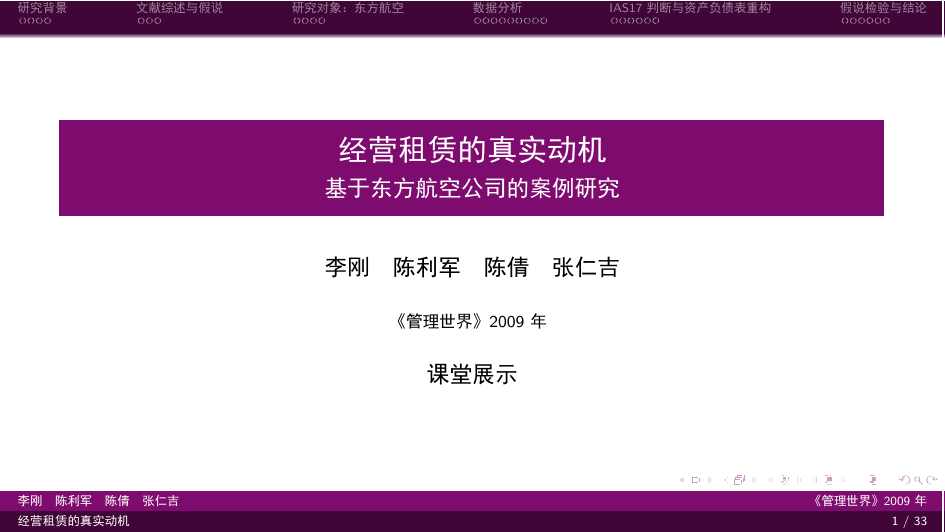
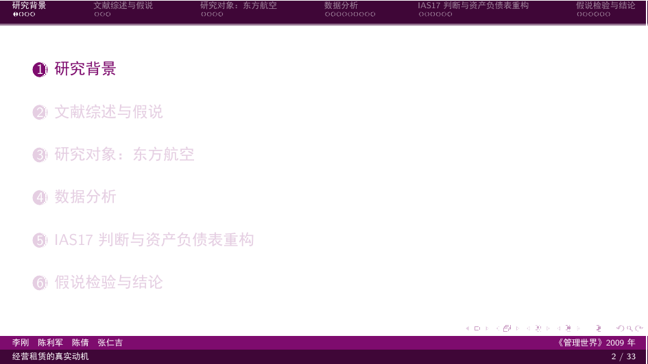
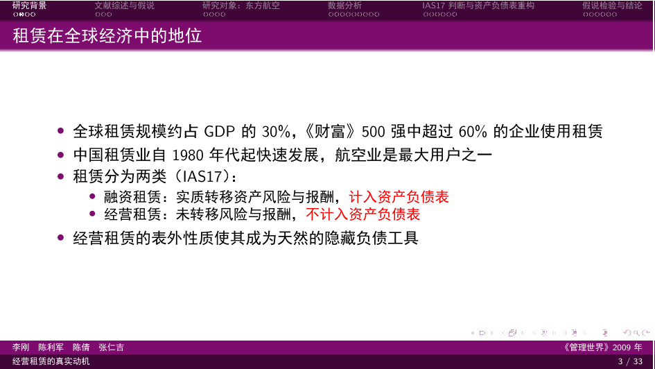
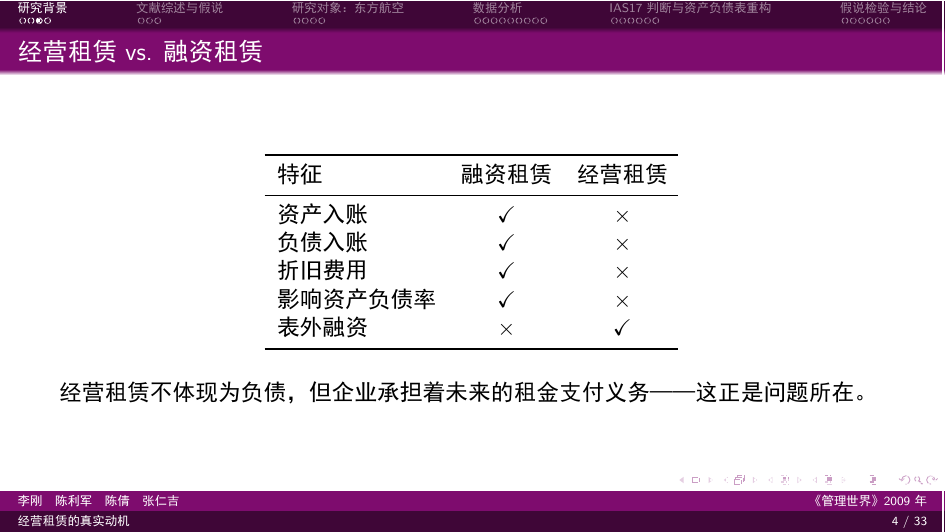
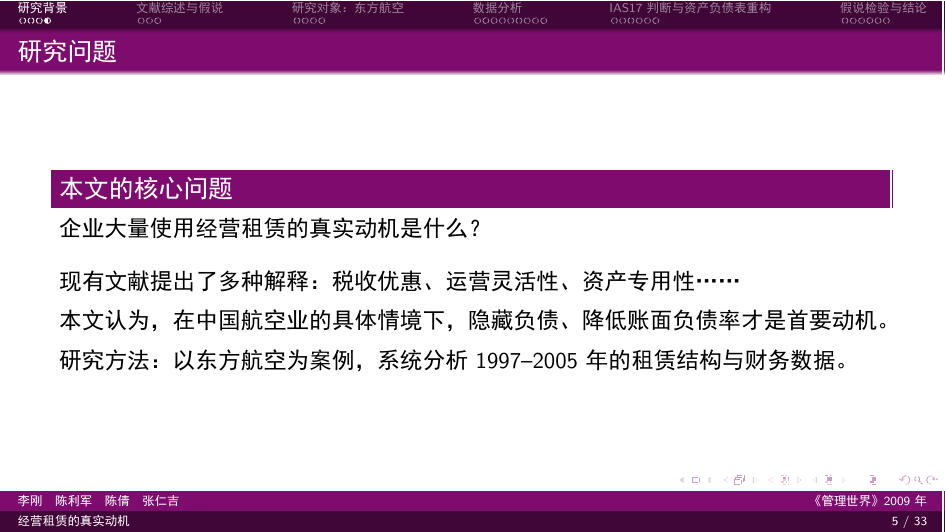
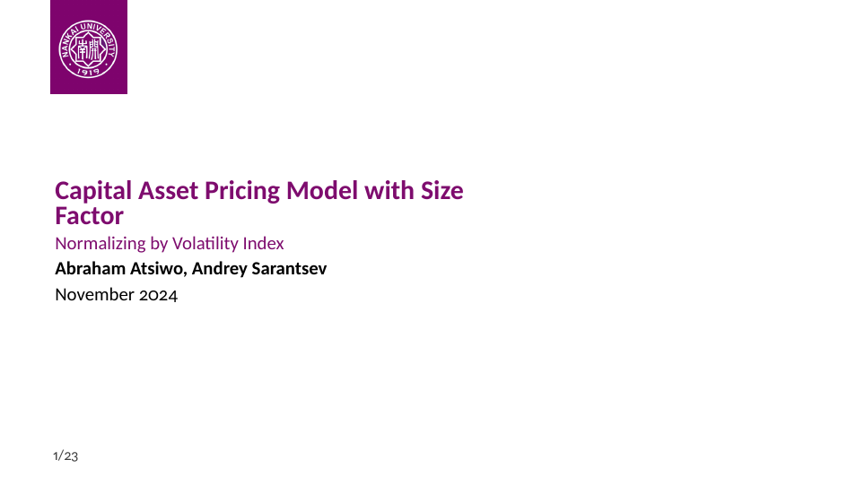
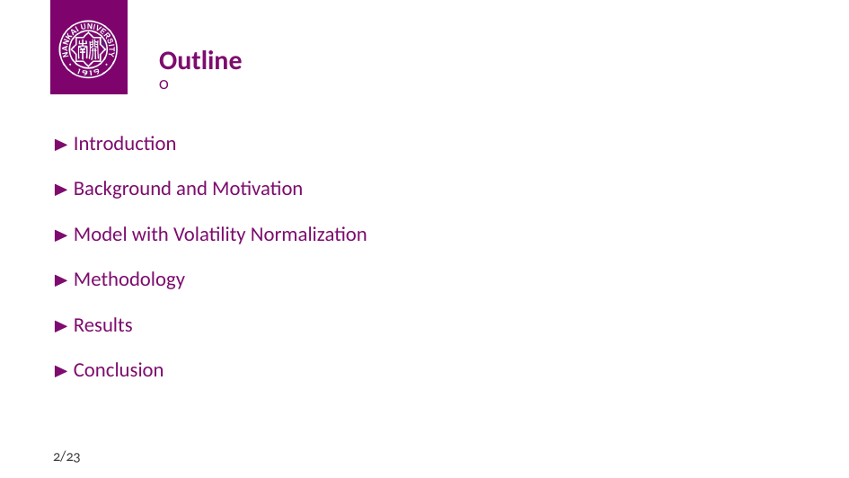
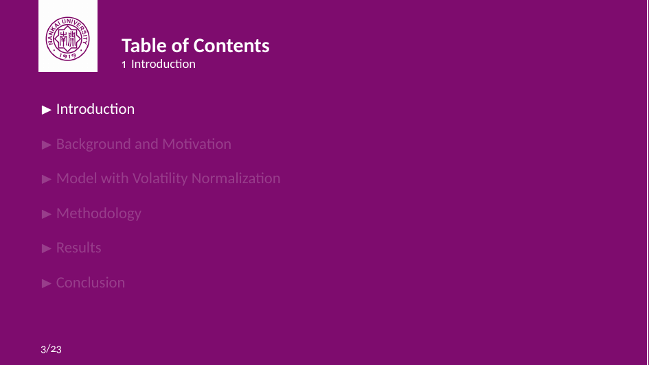
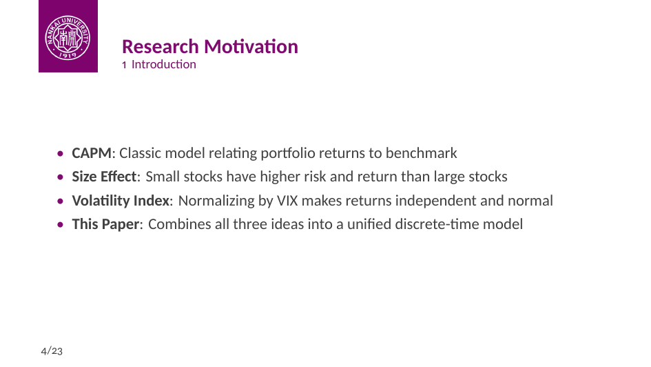
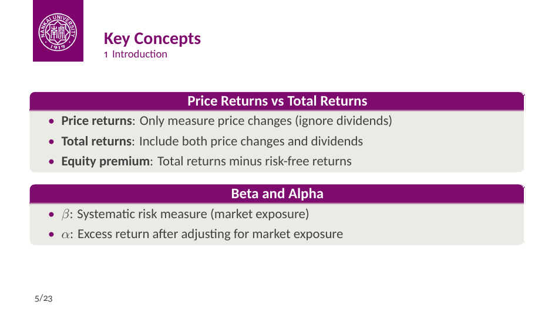

# 南开大学论文汇报一键生成

上传论文PDF，自动生成课堂展示Beamer PPT。目前仓库里放的是南开大学的beamer模板，其它大学或者其他运用场合可自行更换为其他beamer模板。

## 快速开始

### Demo展示

#### 中文示例：[OperatingLease_CEA_LiGang.pdf](demo/OperatingLease_CEA_LiGang.pdf)

<table>
<tr>
<td><br/>封面</td>
<td><br/>目录</td>
<td><br/>内容页</td>
</tr>
<tr>
<td><br/>表格页</td>
<td><br/>尾页</td>
<td></td>
</tr>
</table>

#### 英文示例：[CAPM_Size_Factor.pdf](demo/CAPM_Size_Factor.pdf)

<table>
<tr>
<td><br/>Title</td>
<td><br/>Outline</td>
<td><br/>Content</td>
</tr>
<tr>
<td><br/>Table</td>
<td><br/>Conclusion</td>
<td></td>
</tr>
</table>

### 1. 安装依赖

```bash
pip install pdfplumber pdf2image
```

还需要：
- **XeLaTeX**：Windows 用 [MiKTeX](https://miktex.org/)，Mac 用 `brew install --cask mactex`，Linux 用 `sudo apt install texlive-xetex`
- **pdftoppm**（可选，pdf2image的备选）：Mac 用 `brew install poppler`，Linux 用 `sudo apt install poppler-utils`，Windows 用 [Xpdf tools](https://www.xpdfreader.com/download.html)

### 2. 放入论文PDF

```bash
cp ~/Downloads/your_paper.pdf Papers/
```

### 3. 在Claude Code中运行

```bash
claude
/paper-to-beamer your_paper.pdf
```

运行后会提示选择：

**1. 幻灯片页数：**

| 选项 | 页数 | 适合场合 |
|------|------|---------|
| 精简版 | 12-15页 | 20-30分钟报告 |
| 标准版 | 23-25页 | 45分钟报告 |
| 详细版 | 33-35页 | 60分钟以上报告 |
| 自定义 | 任意 | 直接指定，如 `/paper-to-beamer paper.pdf 12` |

**2. 生成模式：**

| 模式 | 说明 |
|------|------|
| 全自动 | 根据学术pre规范自动生成（推荐） |
| 个性化 | 多轮对话定制重点、风格、听众 |

**3. 表格处理：**

| 模式 | 说明 |
|------|------|
| 自动截图 | pdfplumber + pdftoppm 自动提取 |
| 手动截图 | 系统提示页码，用户自己截图 |
| 纯文本 | 提取数据用 LaTeX 重新排版 |

## 工作流程

```
PDF → 选择模式(自动/个性化) → 选择表格处理(自动/手动/文本)
    → 提取表格 → 分析论文结构 → 应用学术pre规范
    → 生成Beamer .tex → XeLaTeX编译 → 溢出修复 → PDF输出
```

**学术pre规范：**
- Assertion-Evidence 方法（结论性标题）
- 认知负荷优化（每页≤5要点）
- 视觉层次（彩色框突出核心结果）
- 经济学规范（强调经济显著性和因果识别）

## 目录说明

| 目录 | 用途 |
|------|------|
| `Papers/` | 放入论文PDF（不提交到git） |
| `Slides/` | 生成的 `.tex` 和 `.pdf` |
| `Figures/` | 提取的表格图片 |
| `Preambles/` | Beamer主题文件（两种风格可选） |
| `scripts/` | Python辅助脚本 |

## Beamer模板

本项目提供两种南开大学Beamer模板风格：

| 模板 | 说明 | 链接 |
|------|------|------|
| NKU-beamer-template | 作者自制，简洁现代风格 | [GitHub](https://github.com/dawwwn666/NKU-beamer-template) |
| 经典风格 | 传统学术风格 | 位于 `Preambles/` |

## 技能

### 主要命令

| 命令 | 功能 |
|------|------|
| `/paper-to-beamer [pdf]` | 完整流程：PDF → Beamer PPT（交互选择页数） |
| `/paper-to-beamer [pdf] [N]` | 直接指定页数，如 `paper.pdf 12` |

### 自动化流程（无需手动调用）

运行 `/paper-to-beamer` 时，以下步骤自动执行：

| 步骤 | 说明 |
|------|------|
| 编译 | 自动调用 `/compile-latex` 进行3-pass编译 |
| 溢出修复 | 自动调用 `/beamer-overflow-fix` 修复警告 |
| 质量打分 | 自动运行 `quality_score.py` 评分（0-100） |
| 语法审查 | 分数<90时自动调用 `/proofread` 检查 |

### 辅助命令

| 命令 | 功能 |
|------|------|
| `/context-status` | 查看上下文使用情况 |
| `/learn [skill-name]` | 提取学习经验为持久化技能 |

## 质量控制

```bash
# 对生成的 .tex 文件打分（0-100）
python scripts/quality_score.py Slides/your_file.tex

# 质量门槛
# 80/100 - 可以 commit
# 90/100 - 可以发 PR
# 95/100 - 卓越
```

## License

MIT
